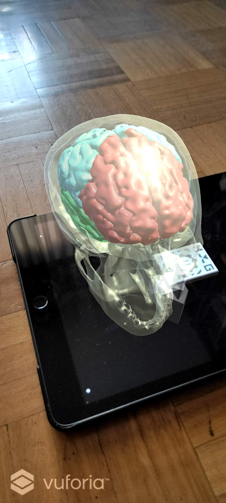
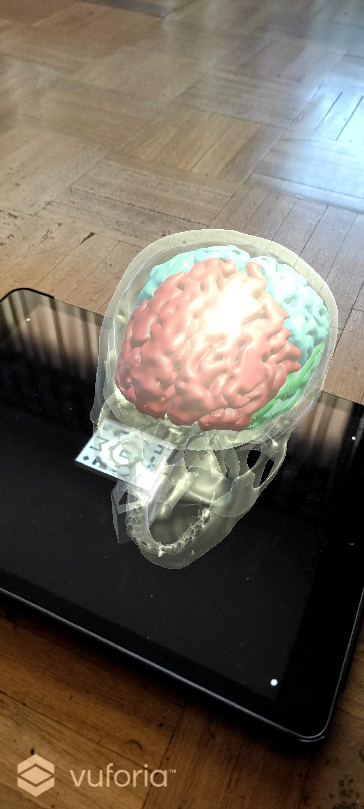

# AR-Android-App
Quick Android app project of augmented reality marker-based to
visualize skull and brain. The 3D models have been orientated in
their initial position using Slicer3D. The marker is a custom design (available in [imgs](/imgs), which 
has been processed using Vuforia to extract some key points. The app is made 
with Unity using the models and the database created with Vuforia.

The app allows you to visualize the models of the skull and the brain with your 
smartphone in any environment.

  
  

